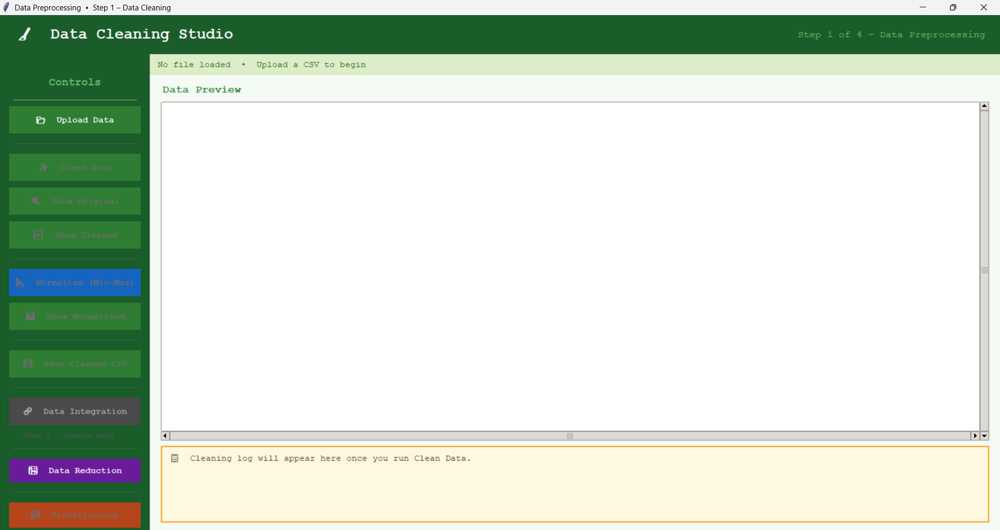
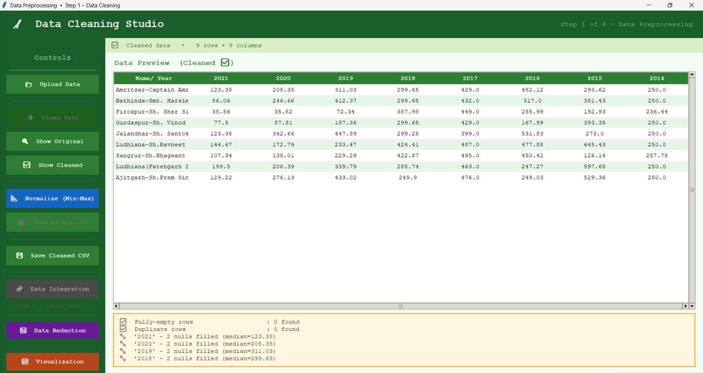
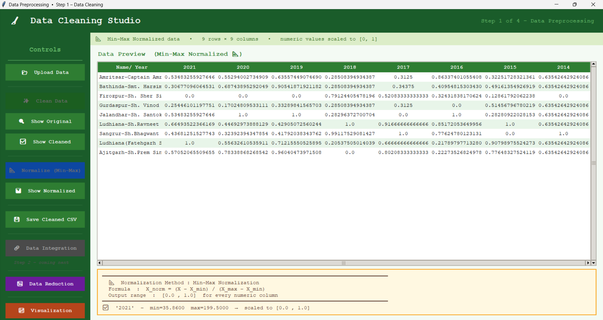
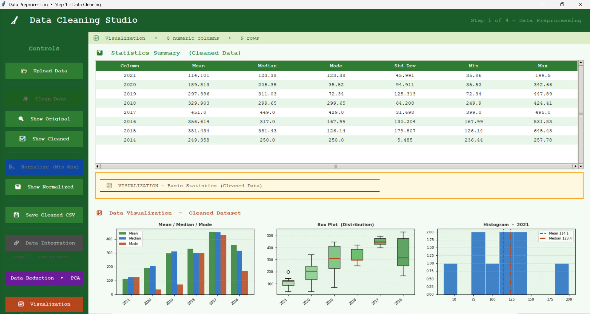
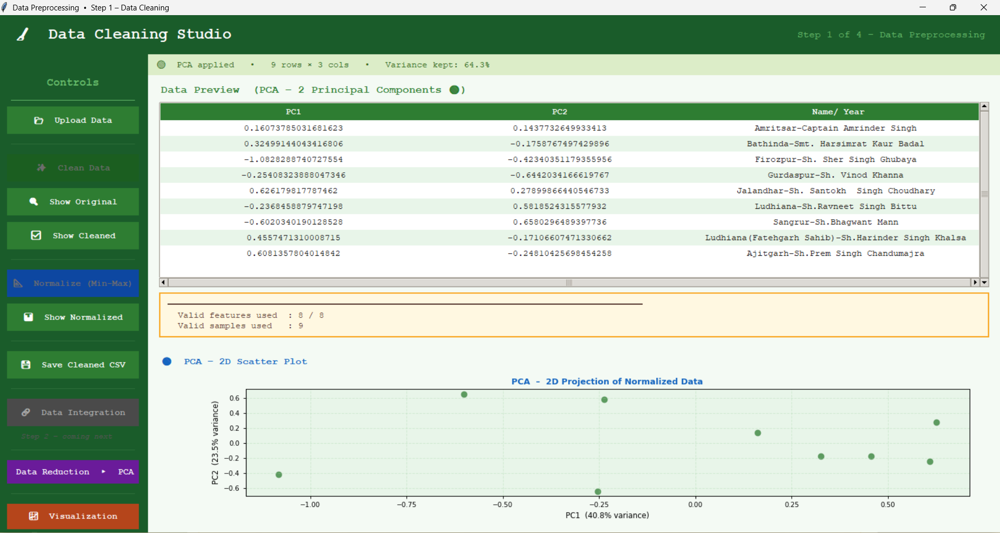

# 🧵 DataWeave Studio

Transform raw data into clean, structured insights through an interactive GUI pipeline.

---

## 📌 Overview

Data preprocessing is one of the most time-consuming and critical steps in any data science workflow.

DataWeave Studio is a **desktop GUI-based data preprocessing application** built using Python that simplifies cleaning, transformation, dimensionality reduction, and visualization of datasets — all without requiring users to write complex code.

---

## 🎯 Problem Statement

Real-world datasets are often:

* Incomplete (missing values)
* Inconsistent (mixed formats)
* Noisy (outliers, duplicates)

👉 This project aims to provide an **intuitive interface** that allows users to process and prepare data efficiently for analysis and machine learning.

---

## 🖥️ UI Preview

### 🔹 Main Dashboard



### 🔹 Data Cleaning



### 🔹 Normalization



### 🔹 Visualization



### 🔹 Data Reduction (PCA / LDA)



---

## ✨ Features

### 🧹 Data Cleaning Pipeline

* Detects and replaces null-like values (`N/A`, `null`, `-`, etc.)
* Removes duplicates and empty rows
* Converts numeric-like strings into numeric format
* Handles missing values:

  * Median (numerical)
  * Mode / `"Unknown"` (categorical)
* Removes outliers using IQR

---

### 📐 Data Transformation

* Min-Max Normalization
* Scales data to range **[0, 1]**
* Handles constant columns safely

---

### 📉 Data Reduction

* PCA (Principal Component Analysis)
* LDA (Linear Discriminant Analysis)

---

### 📊 Data Visualization

* Statistical summary:

  * Mean, Median, Mode, Standard Deviation
* Graphs:

  * Bar charts
  * Box plots
  * Histograms
* Embedded plots inside GUI

---

### 📂 File Handling

* Upload CSV datasets
* Preview original & processed data
* Export cleaned dataset

---

## 🔄 Workflow

Upload Data → Clean → Normalize → Reduce → Visualize → Export

---

## 🛠️ Tech Stack

| Category        | Tools         |
| --------------- | ------------- |
| Language        | Python        |
| GUI             | Tkinter       |
| Data Processing | Pandas, NumPy |
| ML              | Scikit-learn  |
| Visualization   | Matplotlib    |

---

## 📦 Installation

```bash
git clone https://github.com/Priyank-14/dataweave-studio.git
cd dataweave-studio
pip install -r requirements.txt
python app.py
```

---

## 📊 Dataset

* Source: data.gov.in
* Format: CSV

---

## 🔍 Key Insight

This project highlights how **data preprocessing can be transformed from a manual, code-heavy task into an intuitive visual workflow**, improving accessibility for beginners and speeding up data preparation.

---

## 📌 Key Learnings

* Building GUI applications using Tkinter
* Designing modular data processing pipelines
* Applying preprocessing techniques used in real ML workflows
* Integrating visualization within desktop applications

---

## 🔮 Future Improvements

* Drag-and-drop workflow interface
* Support for Excel and JSON formats
* Real-time visualization updates
* Integration with ML model training

---

## 👨‍💻 Author

**Priyank Sinha**
B.Tech CSE | AI/ML Enthusiast

---

## ⭐ Support

If you found this useful, consider giving it a ⭐
